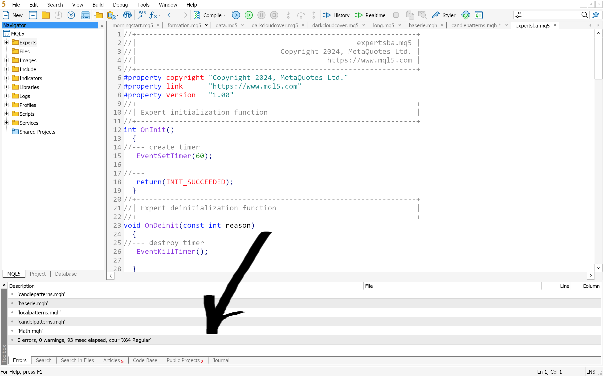
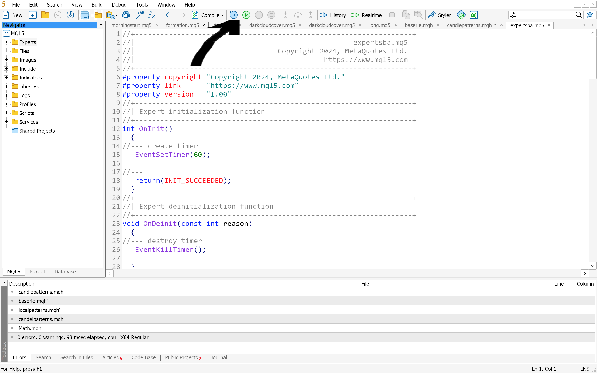

### Création d'un EA

Voici les étapes de base pour créer un Expert Advisor (EA) dans l'éditeur MetaEditor de MetaTrader 5 :

1. **Ouvrir MetaEditor :**
   Lancez MetaEditor depuis MetaTrader 5 en cliquant sur "Outils" dans la barre de menu, puis sélectionnez "Éditeur MetaQuotes".
   

2. **Créer un nouveau fichier :**
   Dans MetaEditor, cliquez sur "Fichier" dans la barre de menu, puis sélectionnez "Nouveau" > "Expert Advisor". Cela ouvrira une nouvelle fenêtre de code pour votre EA.

</img>

</img>

</img>

3. **Écrire le code de l'EA :**
   Utilisez le langage MQL5 pour écrire le code de votre Expert Advisor dans la fenêtre de code nouvellement ouverte. Vous pouvez commencer par les fonctions `OnInit()` et `OnTick()`, qui sont des fonctions de base nécessaires pour chaque EA. `OnInit()` est appelée une seule fois lors du chargement de l'EA, tandis que `OnTick()` est appelée à chaque nouveau tick (changement de prix).

</img>

4. **Compiler le code :**
   Une fois que vous avez écrit le code de votre EA, cliquez sur le bouton "Compiler" dans la barre d'outils ou appuyez sur la touche F7. Cela compilera le code et affichera les éventuelles erreurs de compilation dans la fenêtre de journal.

</img>

5. **Vérifier les erreurs :**
   Si des erreurs de compilation sont détectées, corrigez-les en les recherchant dans la fenêtre de journal et en modifiant votre code en conséquence. Assurez-vous que votre code compile correctement avant de passer à l'étape suivante.

6. **Déboguer si nécessaire :**
   Utilisez les outils de débogage de MetaEditor pour détecter et résoudre les erreurs dans votre code si nécessaire. Vous pouvez ajouter des points d'arrêt, exécuter votre code pas à pas, et surveiller les variables pour identifier les problèmes.

</img>

7. **Enregistrer le fichier :**
   Une fois que votre code est prêt, enregistrez le fichier en cliquant sur "Fichier" dans la barre de menu, puis sélectionnez "Enregistrer". Donnez un nom à votre EA et choisissez l'emplacement où vous souhaitez l'enregistrer.

8. **Tester l'EA :**
   Avant de l'utiliser en conditions réelles, testez votre EA dans le testeur de stratégie intégré à MetaTrader 5 pour vérifier son fonctionnement et ses performances. Vous pouvez accéder au testeur de stratégie en cliquant sur "Affichage" dans la barre de menu, puis en sélectionnant "Stratégie de test".

</img>

9. **Déployer l'EA :**
   Une fois que votre EA a été testé avec succès, vous pouvez le déployer sur votre plateforme de trading MetaTrader 5. Pour ce faire, copiez simplement le fichier .ex5 de votre EA dans le dossier "Experts" de votre répertoire MetaTrader 5.

En suivant ces étapes, vous pourrez créer, compiler, tester et déployer votre propre Expert Advisor dans MetaTrader 5 en utilisant l'éditeur MetaEditor.

#### Les differentes fonctions dans la création d'un EA

Dans la création d'un Expert Advisor (EA) en MQL5, plusieurs fonctions jouent un rôle essentiel pour gérer le comportement de l'EA et interagir avec le serveur de trading. Voici une description des principales fonctions qui interviennent dans la création d'un EA :

1. **OnInit() :**
   La fonction `OnInit()` est appelée une seule fois lors du chargement de l'Expert Advisor. C'est là que vous initialiserez les paramètres de votre EA, tels que les indicateurs à utiliser, les valeurs par défaut des variables, etc.

2. **OnDeinit() :**
   La fonction `OnDeinit()` est appelée lors de la désactivation de l'Expert Advisor. C'est l'endroit où vous libérerez les ressources utilisées par votre EA, comme la suppression des indicateurs personnalisés ou la fermeture de fichiers ouverts.

3. **OnTick() :**
   La fonction `OnTick()` est appelée à chaque nouveau tick (changement de prix) sur le marché. C'est là que la plupart de la logique de trading de votre EA sera mise en œuvre, comme la prise de décision d'achat ou de vente en fonction des conditions du marché.

4. **OnTimer() :**
   La fonction `OnTimer()` est appelée à intervalles réguliers définis par le trader à l'aide de la fonction `EventSetTimer()`. Cela peut être utilisé pour effectuer des tâches de maintenance périodiques ou pour mettre à jour des informations en arrière-plan.

5. **OnTrade() :**
   La fonction `OnTrade()` est appelée en réponse à des événements de trading, tels que l'exécution d'ordres ou les modifications de positions. Vous pouvez l'utiliser pour réagir à ces événements et prendre des mesures appropriées.

6. **OnChartEvent() :**
   La fonction `OnChartEvent()` est appelée en réponse à des événements sur le graphique, comme les clics de souris ou les déplacements de fenêtre. Vous pouvez l'utiliser pour interagir avec l'utilisateur de l'EA ou pour afficher des informations supplémentaires sur le graphique.

7. **OnTimer() :**
   La fonction `OnTimer()` est appelée à intervalles réguliers définis par le trader à l'aide de la fonction `EventSetTimer()`. Cela peut être utilisé pour effectuer des tâches de maintenance périodiques ou pour mettre à jour des informations en arrière-plan.

8. **OnCalculate() :**

   La fonction `OnCalculate()` est utilisée pour calculer les données indicatives personnalisées à partir des données de marché. C'est souvent utilisé lors de l'utilisation d'indicateurs personnalisés ou de la création de systèmes de trading basés sur des indicateurs.

9. **EventSetTimer() et EventKillTimer() :**
   Ces fonctions sont utilisées pour définir et annuler des temporisateurs qui déclenchent l'appel de la fonction `OnTimer()` à intervalles réguliers.

10. **Trade Functions (Trade.*, Order.*, Position.*) :**
    Les fonctions de trading permettent à l'EA d'interagir avec le serveur de trading pour passer des ordres, récupérer des informations sur les positions ouvertes, les ordres en attente, etc. Ces fonctions sont essentielles pour la mise en œuvre de la logique de trading dans votre EA.
