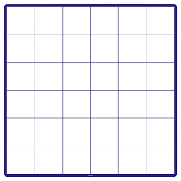

### Les tableaux en MQL5

En MQL5, les tableaux sont des structures de données utilisées pour stocker une collection ordonnée de valeurs du même type. Les tableaux peuvent être unidimensionnels (vecteurs), bidimensionnels (matrices) ou multidimensionnels (tableaux à plusieurs dimensions). 

En MQL5, vous pouvez déclarer un tableau de plusieurs manières, en fonction de vos besoins et de la façon dont vous souhaitez initialiser le tableau. Voici les différentes manières de déclarer un tableau en MQL5 :

### Tableau á une dimension

#### Déclaration avec une taille spécifiée :

Vous pouvez déclarer un tableau en spécifiant sa taille entre crochets `[]`.

```mql5
// Déclaration d'un tableau d'entiers de taille 5
int tableau[5];
```

### Déclaration et initialisation simultanée :
Vous pouvez déclarer un tableau et lui attribuer des valeurs initiales lors de la déclaration.

```mql5
// Déclaration et initialisation d'un tableau d'entiers
int tableau[] = {1, 2, 3, 4, 5};
```

<div></img></div>

#### Comment accéder au tableau

L'accès au élément du tableau s'effectue par leurs indices qui correspondent aux cases dans le tableau. Une fois l'élément localisé on peux effectuer toutes sortes d'opération sur les variables sur ce derniers

```mql5
// Accès au deuxième éléments du tableau
tableau[2]
```

### Parcourir le tableau

Pour parcourir un tableau en MQL5, vous pouvez utiliser des boucles `for`, `while` ou `foreach`, en fonction de votre préférence et des besoins spécifiques de votre programme. Voici comment parcourir un tableau en utilisant ces différentes méthodes :

### Boucle `for` :
Utilisez une boucle `for` lorsque vous connaissez à l'avance la taille du tableau.

```mql5
int tableau[] = {10, 20, 30, 40, 50};

for (int i = 0; i < ArraySize(tableau); i++)
{
    int element = tableau[i];
    Print("Élément ", i, " : ", element);
}
```

### Boucle `while` :
Utilisez une boucle `while` lorsque vous souhaitez parcourir le tableau tant qu'une condition est vraie.

```mql5
int i = 0;
while (i < ArraySize(tableau))
{
    int element = tableau[i];
    Print("Élément ", i, " : ", element);
    i++;
}
```

### Boucle `foreach` :
Utilisez une boucle `foreach` lorsque vous voulez itérer sur tous les éléments du tableau sans se soucier des indices.

```mql5
int tableau[] = {10, 20, 30, 40, 50};

foreach(int element in tableau)
{
    Print("Élément : ", element);
}
```

Les boucles `for`, `while` et `foreach` vous permettent de parcourir efficacement les éléments d'un tableau en MQL5. Choisissez la méthode qui convient le mieux à vos besoins et à la structure de votre programme.


### Tableau á deux dimensions


Vous pouvez déclarer un tableau en spécifiant sa taille entre crochets `[]`.

```mql5
// Déclaration d'un tableau d'entiers de taille 5
int tableau[2][3];
```

### Déclaration et initialisation simultanée :
Vous pouvez déclarer un tableau et lui attribuer des valeurs initiales lors de la déclaration.

```mql5
// Déclaration et initialisation d'un tableau d'entiers
int tableau[] = {
                    {1, 2, 3},
                    {3, 5, 7}
                };
```

<div></img></div>


#### Parcourir un tableau á deux dimension

Pour parcourir un tableau à deux dimensions en MQL5, vous pouvez utiliser une combinaison de boucles `for` imbriquées pour parcourir chaque élément de la matrice. Voici un exemple de parcours d'une matrice 3x3 :

```mql5
int matrice[3][3] = {
    {1, 2, 3},
    {4, 5, 6},
    {7, 8, 9}
};

// Parcours de la matrice
for (int i = 0; i < 3; i++) // Parcourt les lignes
{
    for (int j = 0; j < 3; j++) // Parcourt les colonnes
    {
        int element = matrice[i][j]; // Accès à l'élément de la matrice à la position (i, j)
        Print("Élément à la position (", i, ",", j, ") : ", element);
    }
}
```

Dans cet exemple, nous utilisons deux boucles `for` imbriquées pour parcourir chaque élément de la matrice. La première boucle parcourt les lignes de la matrice (`i`), tandis que la deuxième boucle parcourt les colonnes de la matrice (`j`). À chaque itération des boucles, nous accédons à l'élément de la matrice à la position `(i, j)` en utilisant `matrice[i][j]`, puis nous imprimons cet élément à l'écran à l'aide de la fonction `Print()`.